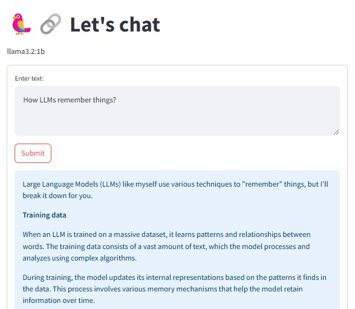

# Chat with Ollama

Ollama is a powerful tool for running and interacting with AI models locally on your machine. This repository provides a guide on how to set up, configure, and chat with Ollama using Python.



## 🛠 Installation
To get started, install Ollama by following these steps:

### 1. Install Ollama
Download and install [Ollama](https://ollama.com/) from the official website:

### 2. Verify Installation
Ensure Ollama is correctly installed by running:
```
ollama --version
```

### 3. Pull a Model
```
ollama pull llama3.2-vision
```

### 4. Python Requirements

- Python 3.8+
- streamlit
- langchain

## Running the Chat Application
```
streamlit run chatbot.py
```

📜 License
This project is licensed under the MIT License.
